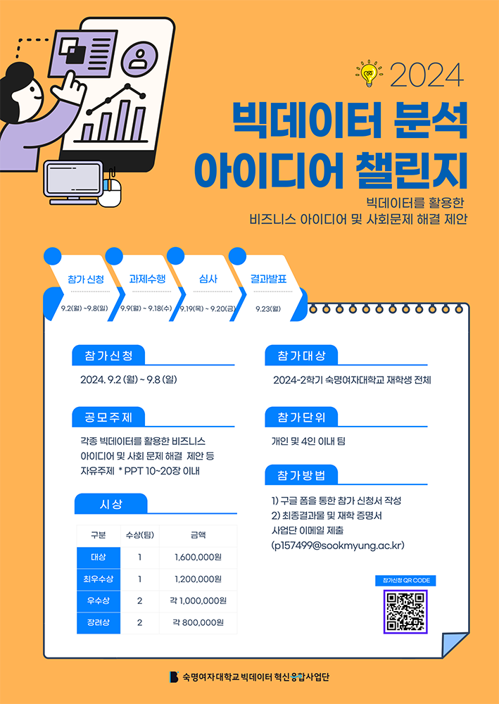
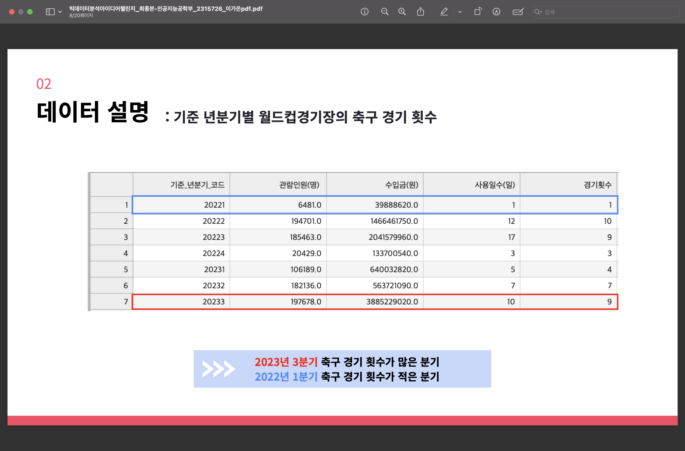

# 2024 Big Data Idea Challenge - Football & Regional Economy

This project was submitted to the **2024 Big Data Analysis Idea Challenge**  hosted by the **Big Data Innovation Convergence Program, Sookmyung Women’s University**.
We analyzed how professional football games influence regional commercial areas, using big data such as match attendance, local sales, and seasonal variations.  
The project proposes a data-driven **business strategy to boost local economy** via football tourism and stadium-linked commerce.

>  **Awarded Excellence Prize** by the Big Data Innovation Convergence Program at **Sookmyung Women’s University**

---

##  Project Theme

**“Analyzing the Economic Impact of Football on Local Business Districts and Proposing Data-Driven Business Strategies”**

---

##  Key Components

-  Analysis Focus: World Cup Stadium vicinity & nearby commercial areas  
-  Data Scope: Monthly / Quarterly data from 2019 to 2023  
-  Tools: Python (pandas, matplotlib, seaborn), heatmap visualization  
-  Approach: Compare football attendance with sales transaction trends

---

##  Tech Stack

---

##  Visual Examples

|  Data Preprocessing |  Monthly Sales Heatmap |  Attendance per Quarter |
|--------------------|--------------------------|----------------------------|
|  |  |  |

---

##  Deliverables

- Full report: `bigdata_soccer2024_presentation.pdf`  
- Code repository: available here  
-  Submitted by GaEun Lee (2315726), AI Engineering,  
  Sookmyung Women’s University  
-  **Award**: Excellence Prize (우수상),  
  Big Data Innovation Convergence Program, SMWU

---
